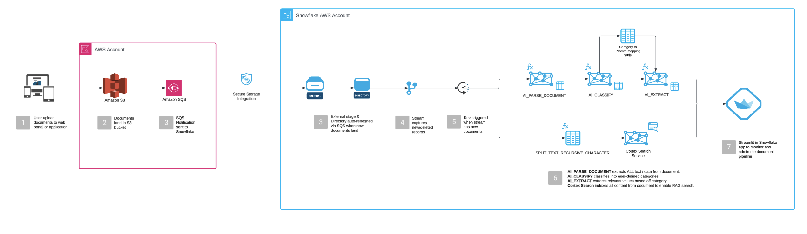

# Snowflake Document AI Pipeline

[](https://www.snowflake.com/)
[](https://www.python.org/)
[](https://streamlit.io/)
[](https://aws.amazon.com/s3/)

**Last Updated:** September 30, 2025  
**Document Types:** 9 classifications | **Extraction Attributes:** 79 attributes

An intelligent, automated document processing pipeline that transforms unstructured documents into structured, searchable data using Snowflake's Cortex AI capabilities.

---

## Key Highlights

- **Automated, Real-time, & Event-driven**: Auto-Refresh Directory Tables + Streams/Tasks process documents within seconds of S3 upload
- **Scalable**: Serverless Tasks auto-scale compute resources based on document volume
- **Cortex AI-Powered**: Leverages `AI_PARSE_DOCUMENT`, `AI_CLASSIFY`, `AI_EXTRACT`, and `CORTEX_SEARCH`
- **Interactive Dashboard**: Streamlit app for visualization, monitoring, and RAG-enabled document chat
- **Multi-Format Support**: PDF, DOCX, PPTX, JPEG, JPG, PNG, TIFF, TIF, HTML, TXT
- **Cost-Effective**: Documents live in S3—no need to load into Snowflake storage

---

## Architecture



### Processing Flow

```
1. UPLOAD    → S3 Bucket (External Stage)
2. PARSE     → AI_PARSE_DOCUMENT (Extract text from PDFs, images, Office docs)
3. CLASSIFY  → AI_CLASSIFY (Categorize into 9 document types)
4. EXTRACT   → AI_EXTRACT (Pull 4-10 structured attributes per type)
5. CHUNK     → Split documents into searchable segments
6. SEARCH    → CORTEX_SEARCH (Semantic search across all documents)
```

### Key Cortex AI Functions

| Function | Purpose |
|----------|---------|
| [AI_PARSE_DOCUMENT](https://docs.snowflake.com/en/user-guide/snowflake-cortex/ai-functions#label-cortex-ai-parse-document) | OCR and text extraction from various formats |
| [AI_CLASSIFY](https://docs.snowflake.com/en/user-guide/snowflake-cortex/ai-functions#label-cortex-ai-classify) | Multi-class document classification |
| [AI_EXTRACT](https://docs.snowflake.com/en/user-guide/snowflake-cortex/ai-functions#label-cortex-ai-extract) | Structured data extraction using natural language prompts |
| [CORTEX_SEARCH](https://docs.snowflake.com/en/user-guide/snowflake-cortex/cortex-search/cortex-search-overview) | Semantic search and retrieval |

**Limits:** 500 pages per document, 100 MB file size

---

## Quick Start

### Prerequisites

- Snowflake account with Cortex AI enabled
- AWS S3 bucket with appropriate IAM permissions
- `COMPUTE_WH` warehouse (or equivalent)
- `ACCOUNTADMIN` role access for initial setup

### Setup Steps

**1. Configure S3 Integration**

Update `01_s3_integration_setup.sql` with your AWS credentials:

```sql
STORAGE_AWS_ROLE_ARN = 'arn:aws:iam::YOUR-ACCOUNT:role/YOUR-SNOWFLAKE-ROLE'
URL = 's3://your-bucket-name/'
```

**2. Deploy Pipeline**

Execute the setup scripts in Snowsight or your preferred SQL client:

```sql
-- First, run 01_s3_integration_setup.sql
-- This creates the external stage and storage integration

-- Then, run 02_document_pipeline_setup.sql  
-- This creates tables, procedures, tasks, and the Cortex Search service
```

**3. Configure S3 Event Notifications**

- Copy the `DIRECTORY_NOTIFICATION_CHANNEL` ARN from step 2 output
- In AWS S3 Console: Properties → Event notifications → Create event notification
- Configure: All object create/remove events → SQS Queue → Paste ARN
- Result: Real-time automatic pipeline triggering within seconds

**4. Launch Dashboard**

Create the Streamlit app in Snowsight:

1. Navigate to **Streamlit** in the left sidebar
2. Click **+ Streamlit App**
3. Configure:
   - **Database**: `DOCUMENT_DB`
   - **Schema**: `S3_DOCUMENTS`
   - **Warehouse**: `COMPUTE_WH`
   - **App name**: `document_ai_dashboard`
4. Click **Create**
5. Copy the contents of `streamlit_document_assistant.py` 
6. Paste into the Snowsight code editor
7. Click **Run** to launch the application

---

## Database Schema

### Core Tables

| Table | Purpose |
|-------|---------|
| `parsed_documents` | Raw parsed document content from AI_PARSE_DOCUMENT |
| `document_classifications` | Classification results from AI_CLASSIFY |
| `document_extractions` | Structured extracted data from AI_EXTRACT |
| `extraction_prompts` | Question templates for each document type (79 prompts) |
| `document_chunks` | Searchable text chunks for Cortex Search |
| `cortex_search_service` | Semantic search index |

### Flattened View

**`document_processing_summary`** - Combines all data into flattened attribute-value pairs:
- Automatically flattens JSON extractions into individual rows
- Includes NULL values (valid for attributes without extracted values)
- One row per document-attribute pair for easy querying

---

## Document Classifications & Attributes

### 1. W2 Tax Form (10 attributes)
**Classification:** `w2` | **Location:** `demo_docs/w2s/`

| Attribute | Description |
|-----------|-------------|
| `employee_name` | Employee's full legal name |
| `employer_name` | Employer company name |
| `employer_ein` | Employer Identification Number |
| `tax_year` | Tax year for the W-2 |
| `wages_tips_compensation` | Box 1 - Wages, tips, other compensation |
| `federal_income_tax_withheld` | Box 2 - Federal income tax withheld |
| `social_security_wages` | Box 3 - Social security wages |
| `social_security_tax_withheld` | Box 4 - Social security tax withheld |
| `medicare_wages` | Box 5 - Medicare wages and tips |
| `state` | State for income tax reporting |

**Business Value:** Automated payroll processing, tax compliance, employee record management

---

### 2. Vendor/Service Contract (10 attributes)
**Classification:** `vendor_contract` | **Location:** `demo_docs/vendor_contracts/`

| Attribute | Description |
|-----------|-------------|
| `vendor_name` | Name of vendor/service provider |
| `client_name` | Name of client/customer company |
| `contract_effective_date` | Contract effective date |
| `contract_expiration_date` | Contract expiration date |
| `contract_term_months` | Length of contract in months/years |
| `total_contract_value` | Total contract value (with currency) |
| `payment_terms` | Payment schedule or terms |
| `services_description` | Brief description of services provided |
| `auto_renewal_clause` | Whether contract auto-renews (Yes/No) |
| `termination_notice_period` | Notice period required for termination |

**Business Value:** Contract lifecycle management, spend analytics, vendor compliance tracking, renewal alerts

---

### 3. Sales Performance Report (8 attributes)
**Classification:** `sales_report` | **Location:** `demo_docs/sales/`

| Attribute | Description |
|-----------|-------------|
| `reporting_period` | Period covered (Q4 2024, FY2025, etc.) |
| `total_revenue` | Total revenue for reporting period |
| `revenue_growth_percent` | Revenue growth percentage (YoY or PoP) |
| `top_performing_region` | Best performing sales region/territory |
| `new_customers_count` | Number of new customers acquired |
| `average_deal_size` | Average deal/contract value |
| `sales_pipeline_value` | Total value in sales pipeline |
| `quota_attainment_percent` | Percentage of sales quota achieved |

**Business Value:** Sales performance tracking, forecasting, territory analysis, quota management

---

### 4. Marketing Campaign Report (9 attributes)
**Classification:** `marketing_report` | **Location:** `demo_docs/marketing/`

| Attribute | Description |
|-----------|-------------|
| `campaign_name` | Name of marketing campaign |
| `reporting_period` | Time period covered |
| `campaign_budget` | Total budget allocated (with currency) |
| `total_impressions` | Total ad impressions |
| `total_clicks` | Total clicks received |
| `click_through_rate` | CTR as a percentage |
| `conversion_rate` | Conversion rate as a percentage |
| `cost_per_acquisition` | CPA or cost per lead |
| `roi_percent` | Return on investment as a percentage |

**Business Value:** Marketing ROI analysis, campaign optimization, budget allocation, performance benchmarking

---

### 5. HR Policy/Handbook (7 attributes)
**Classification:** `hr_policy` | **Location:** `demo_docs/hr/`

| Attribute | Description |
|-----------|-------------|
| `document_title` | Official title of HR policy/handbook |
| `effective_date` | Policy effective date or last update |
| `version_number` | Version or revision number |
| `department` | Responsible department (HR, Legal, etc.) |
| `policy_type` | Type (Handbook, Performance Review, etc.) |
| `approval_authority` | Who approved the policy |
| `last_review_date` | When policy was last reviewed |

**Business Value:** Policy compliance, version control, audit trail, employee onboarding

---

### 6. Corporate Policy (8 attributes)
**Classification:** `corporate_policy` | **Location:** `demo_docs/policies/`

| Attribute | Description |
|-----------|-------------|
| `policy_name` | Name of corporate policy |
| `policy_category` | Category (Expense, Travel, Vendor Mgmt) |
| `effective_date` | When policy takes effect |
| `approval_date` | When policy was approved |
| `policy_owner` | Department/role that owns policy |
| `approval_levels_required` | Required approval levels/authorities |
| `spending_limits` | Key spending limits or thresholds |
| `review_frequency` | How often policy is reviewed |

**Business Value:** Governance, compliance management, spending control, audit preparedness

---

### 7. Financial Infographic/Earnings Report (10 attributes)
**Classification:** `financial_infographic` | **Location:** `demo_docs/financial filings/`

| Attribute | Description |
|-----------|-------------|
| `quarter` | Fiscal quarter (Q1, Q2, Q3, Q4) |
| `fiscal_year` | Fiscal year |
| `revenue` | Total revenue (with currency and units) |
| `revenue_growth_percent` | YoY revenue growth percentage |
| `operating_margin` | Operating margin as a percentage |
| `net_income` | Net income/profit for the period |
| `customers_count` | Total number of customers |
| `customers_over_1m_count` | Enterprise customers (>$1M revenue) |
| `net_revenue_retention_rate` | NRR as a percentage |
| `gross_margin` | Gross margin as a percentage |

**Business Value:** Financial analysis, investor relations, board reporting, competitive benchmarking

---

### 8. Case Study/Customer Success Story (7 attributes)
**Classification:** `case_study` | **Location:** `demo_docs/sales/`

| Attribute | Description |
|-----------|-------------|
| `customer_name` | Name of featured customer/company |
| `industry` | Customer's industry |
| `use_case` | Primary use case or problem solved |
| `business_impact` | Key business impact or result achieved |
| `metrics_improved` | Specific metrics improved |
| `implementation_duration` | How long implementation took |
| `testimonial_quote` | Key testimonial or customer quote |

**Business Value:** Sales enablement, marketing content, customer validation, competitive positioning

---

### 9. Strategy Document (8 attributes)
**Classification:** `strategy_document` | **Location:** `demo_docs/sales/`, `demo_docs/marketing/`

| Attribute | Description |
|-----------|-------------|
| `document_title` | Title of strategy document |
| `planning_period` | Time period covered (2025, FY2025, etc.) |
| `department` | Department/business unit (Marketing, Sales) |
| `strategic_goals` | Main strategic goals or objectives |
| `key_initiatives` | Major initiatives or programs planned |
| `budget_allocation` | Total budget or key allocations |
| `success_metrics` | KPIs or success metrics |
| `document_date` | When strategy document was created |

**Business Value:** Strategic planning, resource allocation, OKR tracking, executive alignment

---

### 10. Other/Fallback (2 attributes)
**Classification:** `other` | **Location:** Any unrecognized document

| Attribute | Description |
|-----------|-------------|
| `document_title` | Title of document |
| `document_date` | Document date or most relevant date |

**Business Value:** Ensures all documents are processed with minimal metadata

---

## Core Components

### Stored Procedures

| Procedure | Purpose |
|-----------|---------|
| `parse_new_documents()` | Parse documents using AI_PARSE_DOCUMENT (LAYOUT mode with OCR fallback) |
| `classify_parsed_documents()` | Classify documents into 9 types using AI_CLASSIFY |
| `extract_attributes_for_classified_documents()` | Extract 4-10 attributes per document using AI_EXTRACT |
| `chunk_classified_documents()` | Create searchable chunks for Cortex Search |

### Automated Tasks

**Stream-Triggered Pipeline:**
1. `parse_document_task` - Triggered by new S3 files
2. `classify_document_task` - Runs after parsing completes
3. `extract_attributes_task` - Runs after classification completes
4. `chunk_document_task` - Runs after extraction completes

All tasks auto-scale with serverless compute and can be monitored via:
```sql
SHOW TASKS IN SCHEMA document_db.s3_documents;
```

---

## Cost Analysis

### Pricing Details

Snowflake Cortex AI functions are billed based on token consumption. All pricing is in Snowflake credits.

#### AI_PARSE_DOCUMENT

**Token Calculation:**
- PDF/DOCX/PPTX: 970 tokens per page
- Images (JPEG, PNG, TIFF): 970 tokens per image
- HTML/TXT: 970 tokens per 3,000 characters

**Pricing (as of September 2025):**
- **Standard Edition**: 0.0004 credits per 1,000 tokens
- **Enterprise Edition**: 0.0004 credits per 1,000 tokens

**Example Cost:**
- 100-page PDF = 97,000 tokens = 0.0388 credits (~$0.04 at $1/credit)
- 1,000 pages = 0.388 credits (~$0.39)

#### AI_CLASSIFY

**Pricing:**
- **Standard/Enterprise**: 0.00055 credits per 1,000 tokens

**Typical Usage:**
- Classification uses the full document text (up to token limits)
- Average document (5 pages, ~1,500 words) ≈ 2,000 tokens
- Cost per document: ~0.0011 credits (~$0.001)
- 1,000 documents: ~1.1 credits (~$1.10)

#### AI_EXTRACT

**Pricing:**
- **Standard/Enterprise**: 0.00055 credits per 1,000 tokens

**Usage Pattern:**
- Uses document content + extraction prompts
- 9 document types with 4-10 attributes each
- Average: 3,000-5,000 tokens per document extraction
- Cost per document: ~0.0017-0.0028 credits (~$0.002-$0.003)
- 1,000 documents: ~1.7-2.8 credits (~$1.70-$2.80)

#### CORTEX_SEARCH

**Pricing:**
- **Storage**: Minimal cost for search index (based on storage pricing)
- **Query**: 0.00055 credits per 1,000 tokens
- **Typical search query**: 100-500 tokens
- Cost per search: ~0.00006-0.00028 credits (~$0.00006-$0.00028)

### Total Cost Estimate (Per 1,000 Documents)

Assuming average document complexity:
- **AI_PARSE_DOCUMENT**: ~$3.88 (10 pages avg)
- **AI_CLASSIFY**: ~$1.10
- **AI_EXTRACT**: ~$2.25 (avg 7 attributes)
- **CORTEX_SEARCH**: ~$0.50 (including indexing and queries)

**Total: ~$7.73 per 1,000 documents** (at $1 per credit)

### Cost Optimization Strategies

1. **Batch Processing**: Process documents in scheduled batches to optimize resource usage
2. **Selective Parsing**: Skip AI_PARSE_DOCUMENT for documents already in text format
3. **Prompt Optimization**: Keep extraction prompts concise to reduce token consumption
4. **Chunking Strategy**: Optimize chunk size based on actual search requirements
5. **Monitor Usage**: Use Streamlit dashboard to track usage patterns and identify optimization opportunities
6. **Classification Caching**: Reuse classifications for similar document types
7. **Incremental Processing**: Only process new/changed documents

### Monitoring Costs

View your AI function usage in the Streamlit dashboard or query directly:

```sql
-- View parse operations
SELECT COUNT(*) as total_parses, 
       SUM(LENGTH(content_text)) / 1000 as approx_tokens_k
FROM document_db.s3_documents.parsed_documents
WHERE parse_timestamp >= DATEADD(day, -30, CURRENT_TIMESTAMP());

-- View extractions
SELECT document_class, 
       COUNT(*) as extraction_count,
       COUNT(DISTINCT attribute_name) as unique_attributes
FROM document_db.s3_documents.document_extractions
WHERE extraction_timestamp >= DATEADD(day, -30, CURRENT_TIMESTAMP())
GROUP BY document_class;
```

---

## Dashboard Features

The Streamlit dashboard provides a comprehensive interface for managing and monitoring the document processing pipeline:

- **Pipeline Overview**: Real-time processing metrics and status
- **Document Explorer**: Browse individual documents and extracted data
- **AI Assistant**: Chat with your documents using RAG (Retrieval Augmented Generation)
- **Pipeline Control**: Manual processing triggers and task management
- **Cost Monitoring**: Track AI usage and estimated costs across all Cortex functions
- **Search Interface**: Semantic search across all processed documents