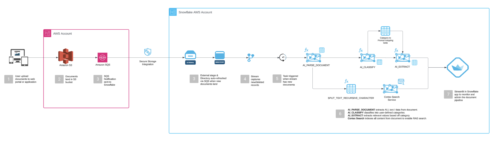

# Snowflake Document Classification and Extraction

[](https://www.snowflake.com/)
[](https://www.python.org/)
[](https://streamlit.io/)
[](https://aws.amazon.com/s3/)

**Last Updated:** October 1, 2025

---

## Table of Contents

1. [Overview](#overview)
2. [Key Highlights](#key-highlights)
3. [Process Flow](#process-flow)
4. [Architecture](#architecture)
5. [Prerequisites](#prerequisites)
6. [Quick Start](#quick-start)
7. [Cost Overview](#cost-overview)
8. [Appendix](#appendix)
   - [Database Schema](#database-schema)
   - [Document Classifications](#document-classifications)
   - [Dashboard Features](#dashboard-features)

---

## Overview

An intelligent, automated document processing pipeline that transforms unstructured documents into structured, searchable data using Snowflake's Cortex AI capabilities. The system processes documents stored in AWS S3, classifies them into business document types, extracts structured attributes, and enables semantic search across all content.

---

## Key Highlights

- **Automated, Real-time, & Event-driven**: Auto-Refresh Directory Tables + Streams/Tasks process documents within seconds of S3 upload
- **Human in the Loop**: Use confidence scores to flag extracted values and take action
- **Scalable**: Serverless Tasks auto-scale compute resources based on document volume
- **Cortex AI-Powered**: Leverages `AI_PARSE_DOCUMENT`, `AI_CLASSIFY`, `AI_EXTRACT`, and `CORTEX_SEARCH`
- **Interactive Dashboard**: Streamlit app for visualization, monitoring, RAG-enabled document chat, and Cost overview
- **Multi-Format Support**: PDF, DOCX, PPTX, JPEG, JPG, PNG, TIFF, TIF, HTML, TXT
- **Cost-Effective**: Documents live in S3—no need to load into Snowflake storage

---

## Process Flow

The pipeline processes documents through seven automated stages:

```
1. UPLOAD       → Documents uploaded to S3 bucket
2. PARSE        → AI_PARSE_DOCUMENT extracts text (OCR + layout analysis)
3. CLASSIFY     → AI_CLASSIFY categorizes into 9 document types
4. EXTRACT      → AI_EXTRACT pulls 4-10 structured attributes per type
5. CHUNK        → Documents split into searchable segments
6. SEARCH       → CORTEX_SEARCH enables semantic search
7. VISUALIZE    → Streamlit dashboard for exploration and chat
```

**Key Cortex AI Functions:**

| Function | Purpose | Cost Documentation |
|----------|---------|-------------------|
| [AI_PARSE_DOCUMENT](https://docs.snowflake.com/en/user-guide/snowflake-cortex/parse-document) | OCR and text extraction from various formats | [Pricing](https://docs.snowflake.com/en/user-guide/snowflake-cortex/parse-document#cost-considerations) |
| [AI_CLASSIFY](https://docs.snowflake.com/en/sql-reference/functions/ai_classify) | Multi-class  classification | [Pricing](https://docs.snowflake.com/en/sql-reference/functions/ai_classify#cost-considerations) |
| [AI_EXTRACT](https://docs.snowflake.com/en/sql-reference/functions/ai_extract) | Structured data extraction using natural language prompts | [Pricing](https://docs.snowflake.com/en/sql-reference/functions/ai_extract#cost-considerations) |
| [CORTEX_SEARCH](https://docs.snowflake.com/en/user-guide/snowflake-cortex/cortex-search/cortex-search-overview) | Semantic search and retrieval | [Pricing](https://docs.snowflake.com/en/user-guide/snowflake-cortex/cortex-search/cortex-search-costs) |

---

## Architecture



The architecture uses Snowflake's native capabilities for automated, event-driven document processing:

- **Storage Layer**: AWS S3 (external stage) stores all documents
- **Ingestion Layer**: Directory tables with auto-refresh detect new files
- **Processing Layer**: Stream-triggered tasks execute AI functions sequentially
- **Search Layer**: Cortex Search service indexes chunked content
- **Application Layer**: Streamlit in Snowflake for user interaction

---

## Prerequisites

Before setting up the pipeline, ensure you have:

- **Snowflake Account**: With Cortex AI enabled (Enterprise Edition or higher recommended)
- **AWS S3 Bucket**: Configured with appropriate IAM permissions for Snowflake access
- **Compute Resources**: `COMPUTE_WH` warehouse (or equivalent) with sufficient credits
- **Permissions**: `ACCOUNTADMIN` role access for initial setup
- **Network Access**: Ability to configure S3 event notifications (SQS integration)

---

## Quick Start

### Step 1: Configure S3 Integration

Update `01_s3_integration_setup.sql` with your AWS credentials:

```sql
STORAGE_AWS_ROLE_ARN = 'arn:aws:iam::YOUR-ACCOUNT:role/YOUR-SNOWFLAKE-ROLE'
URL = 's3://your-bucket-name/'
```

### Step 2: Deploy Pipeline

Execute the setup scripts in Snowsight or your preferred SQL client:

```sql
-- First, run 01_s3_integration_setup.sql
-- Creates external stage and storage integration

-- Then, run 02_document_pipeline_setup.sql  
-- Creates tables, procedures, tasks, and Cortex Search service
```

### Step 3: Configure S3 Event Notifications

1. Copy the `DIRECTORY_NOTIFICATION_CHANNEL` ARN from Step 2 output
2. In AWS S3 Console: **Properties** → **Event notifications** → **Create event notification**
3. Configure:
   - **Event types**: All object create and remove events
   - **Destination**: SQS Queue
   - **Queue ARN**: Paste the copied ARN
4. Save configuration

### Step 4: Create Streamlit Dashboard

Build the dashboard in Snowsight:

1. Navigate to **Streamlit** in the left sidebar
2. Click **+ Streamlit App**
3. Configure app settings:
   - **Database**: `DOCUMENT_DB`
   - **Schema**: `S3_DOCUMENTS`
   - **Warehouse**: `COMPUTE_WH`
   - **App name**: `document_ai_dashboard`
4. Click **Create**
5. Copy the contents of `streamlit_document_assistant.py`
6. Paste into the Snowsight code editor
7. Click **Run** to launch the application

### Step 5: Test Pipeline End-to-End

1. **Upload test documents** to your S3 bucket:
   ```bash
   aws s3 cp demo_docs/ s3://your-bucket-name/demo_docs/ --recursive
   ```

2. **Monitor processing** (should complete within 1-2 minutes):
   ```sql
   -- Check parsed documents
   SELECT COUNT(*), status 
   FROM document_db.s3_documents.parsed_documents 
   GROUP BY status;
   
   -- Check classifications
   SELECT COUNT(*), document_class 
   FROM document_db.s3_documents.document_classifications 
   GROUP BY document_class;
   
   -- Check extractions
   SELECT COUNT(*) 
   FROM document_db.s3_documents.document_extractions;
   ```

3. **View results** in flattened summary:
   ```sql
   SELECT * 
   FROM document_db.s3_documents.document_processing_summary
   LIMIT 100;
   ```

4. **Test semantic search**:
   ```sql
   SELECT * FROM TABLE(
     document_db.s3_documents.document_search_service.SEARCH(
       'What are the contract renewal dates?', 5
     )
   );
   ```

### Step 6: Clean Up (Optional)

To reset the pipeline and remove all processed data, execute the cleanup script `03_cleanup_utilities.sql` in Snowsight.

**WARNING:** This will delete all tables and data.

---

## Appendix

### Database Schema

**Core Tables:**

| Table | Purpose |
|-------|---------|
| `parsed_documents` | Raw parsed document content from AI_PARSE_DOCUMENT |
| `document_classifications` | Classification results from AI_CLASSIFY |
| `document_extractions` | Structured extracted data from AI_EXTRACT |
| `extraction_prompts` | Question templates for each document type (79 prompts) |
| `document_chunks` | Searchable text chunks for Cortex Search |

**Flattened View:**

`document_processing_summary` - Combines all data into attribute-value pairs with automatic JSON flattening

**Stored Procedures:**

1. `parse_new_documents()` - Parse documents using AI_PARSE_DOCUMENT
2. `classify_parsed_documents()` - Classify into 9 document types
3. `extract_attributes_for_classified_documents()` - Extract structured attributes
4. `chunk_classified_documents()` - Create searchable chunks

**Automated Tasks:**

Stream-triggered pipeline: `parse_document_task` → `classify_document_task` → `extract_attributes_task` → `chunk_document_task`

---

### Document Classifications

The system supports 9 document types with targeted attribute extraction:

1. **W2 Tax Form** (10 attributes) - Employee name, employer, wages, taxes, state
2. **Vendor Contract** (10 attributes) - Vendor name, contract dates, value, terms, renewal clause
3. **Sales Report** (8 attributes) - Revenue, growth %, regions, pipeline, quota attainment
4. **Marketing Report** (9 attributes) - Campaign name, budget, impressions, clicks, CTR, conversion, ROI
5. **HR Policy** (7 attributes) - Policy title, effective date, version, department, approval
6. **Corporate Policy** (8 attributes) - Policy name, category, effective date, spending limits
7. **Financial Infographic** (10 attributes) - Quarter, revenue, margins, customer metrics, NRR
8. **Case Study** (7 attributes) - Customer name, industry, use case, business impact, metrics
9. **Strategy Document** (8 attributes) - Title, planning period, goals, initiatives, KPIs

**Sample Locations:** All demo documents are organized in `demo_docs/` by type (w2s/, vendor_contracts/, sales/, marketing/, hr/, policies/, financial filings/)

---

### Dashboard Features

The Streamlit dashboard provides:

- **Pipeline Overview** - Real-time processing metrics, document counts, and task status
- **Document Explorer** - Browse documents, view classifications, and extracted attributes
- **AI Assistant** - RAG-enabled chat interface for natural language document queries
- **Semantic Search** - Search across all processed documents using Cortex Search
- **Pipeline Control** - Manual trigger buttons for each processing step
- **Cost Monitoring** - Track AI function usage and estimated costs
- **Analytics** - Processing trends, success rates, and attribute distribution charts

**Access the dashboard:**
1. Navigate to **Streamlit** in Snowsight
2. Open `document_ai_dashboard`
3. Select your warehouse and run